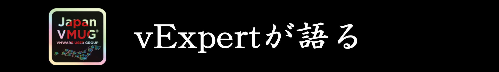

# Japan VMUG「vExpert が語る」

# 1. Overview

## 企画について

Japan VMUG (VMware User Group) と vExpert Pro とで、「vExpertが語る会」を定期的に開催しています。
* 会名のとおり、vExpert をお呼びして話を聞きたい。
  - VMware vExpert については [こちら](https://vexpert.vmware.com/) 。
* 所属組織を越えたvExpertのコミュニティ活動の場をつくりたい。
* 「これからvEを目指したい人」にも登壇機会を提供したい。
* vExpert Pro(moter) とは、vExpert のメンター的な役割を担当しています。

## 開催概要
※第1回 ～ 2回はこんな感じでしたが、最近はこれにかぎらず自由にといった感じです。
* 月1回くらい
* Zoomで開催（双方向コミュニケーションしやすいように、Webinar でなく Meeting で開催）
* セッション： スピーカーあたり30分程度
  - スピーチ（15分程度）
    - 自己紹介、VMware関連の活動について
    - VMwareで最近興味のあるものについて
    - vExpertになったきっかけは？
  - お話の内容をもとに参加者で質問・意見交換など（15分程度）

* 録画は [Youtubeチャネル](https://www.youtube.com/channel/UCigY5fIsNIy4BbmlTlV_Y-A) で公開（任意）

## Organizers / Moderators

* [Kaz Igarashi](https://vexpert.vmware.com/directory/1653)
  - Japan VMUG Leader
  - vExpert (Pro, Security)
* [Go Watanabe](https://vexpert.vmware.com/directory/521)
  - VMTN User Moderator(Japanese Forum), Blogger, Japan VMUG Member
  - vExpert (Pro, NSX, Application Modernization, Avi)
* [Atsushi Kimura](https://vexpert.vmware.com/directory/8813) (メイン司会担当)
  - Japan VMUG Member
  - vExpert
* [Yamato Sakai](https://vexpert.vmware.com/directory/1668) (～ #14)
  - VMware Certified Instructer, Author, Blogger
  - vExpert

---
# 2. Events

イベント案内は vmug.com に用意されますが、（現状では）終了したイベントが非表示になってしまうので、  
こちらにも開催履歴を用意しました。

---
## #27. 2023年06月02日（水）18:00 - 20:00 [[Event Page](https://vmug-jp.connpass.com/event/284877/)][[Recording Playlist](https://www.youtube.com/playlist?list=PLo45fa-pfArsgZSzLZKHfxrvEa-zvrcBZ)]

27回目の「vExpertが語る」 今回のテーマは、vExpert サブプログラム。

2023/04/15(JST) に、[vExpert 2023 サブプログラムの受賞者](https://blogs.vmware.com/vexpert/2023/04/20/vexpert-2023-sub-program-award-announcement/) が発表されました。

vExpertサブプログラムとはVMware製品分野ごとにコミュニティ貢献者を表彰するもので、今年はApplication Modernization、Avi、Cloud Management、Cloud Provider、EUC、Multi-Cloud、NSX、Security、vExpert PROの9種類があります。

ということで、今年度の各サブプログラムの紹介やLTしたいと思います。

※サブプログラムに限らず今回もLT募集中です。vExpert 2023 2nd-half への応募（予定では6/5～6/30が応募期間）を検討されているかた、ぜひご参加ください。

### Session Speakers
* [Go Watanabe](https://vexpert.vmware.com/directory/521)
  - vExpert 2023 Sub-Programs の紹介 [[Recording](https://www.youtube.com/watch?v=i4uJzgeUpXM&list=PLo45fa-pfArsgZSzLZKHfxrvEa-zvrcBZ)]
* [Go Watanabe](https://vexpert.vmware.com/directory/521)
  - vSphere with Tanzu だけではない お手軽 Kubernetes 環境構築 [[Recording](https://www.youtube.com/watch?v=WHn8pHIfYNk&list=PLo45fa-pfArsgZSzLZKHfxrvEa-zvrcBZ)]
* [Kaz Igarashi](https://vexpert.vmware.com/directory/1653)
  - VMware Carbon Black Cloud Python SDK を触ってみた [[Recording](https://www.youtube.com/watch?v=HqqCGP9iNLQ&list=PLo45fa-pfArsgZSzLZKHfxrvEa-zvrcBZ)]
* [Takuya Ichijima](https://vexpert.vmware.com/directory/4604)
  - AWS 上で動かす Horizon について調べてみた [[Recording](https://www.youtube.com/watch?v=HwtYgtcTTRU&list=PLo45fa-pfArsgZSzLZKHfxrvEa-zvrcBZ)]
* [Masato Narishige](https://vexpert.vmware.com/directory/3805)
  - Japan vExpert EUC & Security / 自動隔離や脆弱性チェックを試してみた [[Recording](https://www.youtube.com/watch?v=kVwCz7laHlw&list=PLo45fa-pfArsgZSzLZKHfxrvEa-zvrcBZ)]

### Moderator
* [Atsushi Kimura](https://vexpert.vmware.com/directory/8813)

###  Event Organizers(vExpert Pro)
* [Go Watanabe](https://vexpert.vmware.com/directory/521)
* [Masato Narishige](https://vexpert.vmware.com/directory/3805)
* [Kaz Igarashi](https://vexpert.vmware.com/directory/1653)

---
## #26. 2023年04月12日（水）18:00 - 20:00 [[Event Page](https://vmug-jp.connpass.com/event/279140/)][[Recording Playlist](https://www.youtube.com/playlist?list=PLo45fa-pfArtc2uIEfx1-GGftXQAk7vso)]

26回目の「vExpertが語る」 今回のテーマは、約1年半振りのEnd User Computing（EUC）。

この1年半の間でも日進月歩で変わりまくっているEUCのトレンドや日本国内での動向など、普段EUC導入に携わっているEUCのプロフェッショナルに、vExpertならではの切り口で語っていただきます。

ここでしか聴くことができない○と✕など、配信ではカットされちゃう”ポロリ”もあるかも！？

### Session Speakers

* [Akito Ogushi](https://vexpert.vmware.com/directory/6209)
  - みんな大好きVMware Flings - EUC編 - [[Recording](https://www.youtube.com/watch?v=JaO4nSoMs3o&list=PLo45fa-pfArtc2uIEfx1-GGftXQAk7vso)]
* [Daisuke Yajima](https://vexpert.vmware.com/directory/3528)
  - 普段Workspace ONE Accessを触っている人がOktaも触ってみた話 [[Recording](https://www.youtube.com/watch?v=983M9mYae2U&list=PLo45fa-pfArtc2uIEfx1-GGftXQAk7vso)]
* [Tomoyuki Kawata](https://vexpert.vmware.com/directory/3982)
  - 仮想化技術による医療DX実現への道  
    ～上級医療情報技師がvExpertの視点から語る、医療現場の変革と挑戦～ [[Recording](https://www.youtube.com/watch?v=iop0dHM1FGM&list=PLo45fa-pfArtc2uIEfx1-GGftXQAk7vso)]
* [Takuya Ichijima](https://vexpert.vmware.com/directory/4604)
  - Horizon Cloud Service - next-gen
    何が次世代なのか調べてみた [[Recording](https://www.youtube.com/watch?v=VUiKBL9KPeA&list=PLo45fa-pfArtc2uIEfx1-GGftXQAk7vso)]
* [Go Watanabe](https://vexpert.vmware.com/directory/521)
  - PowerCLI と Horizon VMware.Hv.Helper 超入門 [[Recording](https://www.youtube.com/watch?v=4xd2fTFpkDM&list=PLo45fa-pfArtc2uIEfx1-GGftXQAk7vso)] ※2次会

### Moderator
* [Atsushi Kimura](https://vexpert.vmware.com/directory/8813)

###  Event Organizers(vExpert Pro)
* [Go Watanabe](https://vexpert.vmware.com/directory/521)
* [Masato Narishige](https://vexpert.vmware.com/directory/3805)
* [Kaz Igarashi](https://vexpert.vmware.com/directory/1653)

---
## #25. 2023年03月14日（火）18:00 - 20:00 [[Event Page](https://vmug-jp.connpass.com/event/277109/)][[Recording Playlist](https://www.youtube.com/playlist?list=PLo45fa-pfArvWHi7Q2NPxcC38-j8weong)]

vExpert が語る会 第25回を開催します！  
日本時間3月3日の1:00から vExpert Program で開催された Zoom セッション  
「[vExpert] We Want to Help You Win / Earn the 2023 vExpert Award」の内容を受け、  
vExpert を受賞するためにどのような活動をしたら良いのか、最新の審査傾向を盛り込み  
2023年の 2nd-half または 2024年以降も継続して vExpert を目指すみなさまに有益となる情報をお伝えできればと思います。  
ご参加お待ちしています！

### Session Speakers

* [Masato Narishige](https://vexpert.vmware.com/directory/3805)
  - Go to vExpert MkⅡ [[Recording](https://www.youtube.com/watch?v=663ZPyn6bD8&list=PLo45fa-pfArvWHi7Q2NPxcC38-j8weong)]

* [Kaz Igarashi](https://vexpert.vmware.com/directory/1653)
  - vExpert Award 審査の傾向とその背景 [[Recording](https://www.youtube.com/watch?v=KtlWQFEfgQM&list=PLo45fa-pfArvWHi7Q2NPxcC38-j8weong)]

* [Go Watanabe](https://vexpert.vmware.com/directory/521)
  - vExpert 応募の様子（自分の場合） [[Recording](https://www.youtube.com/watch?v=8zpdfD-BJCA&list=PLo45fa-pfArvWHi7Q2NPxcC38-j8weong)]

* [Yuki Kawamitsu](https://vexpert.vmware.com/directory/477)
  - VMware の内と外をつなげるコミュニティ活動へ:  
    VMware CTO Ambassador プログラムの紹介 [[Recording](https://www.youtube.com/watch?v=Zr-kB168FOw&list=PLo45fa-pfArvWHi7Q2NPxcC38-j8weong)]

* [Toshihisa Noguchi](https://vexpert.vmware.com/directory/4870)
  - vExpertになってよかったことと、今年の活動について [[Recording](https://www.youtube.com/watch?v=0qTCPaQYVFo&list=PLo45fa-pfArvWHi7Q2NPxcC38-j8weong)]

### Moderator
* [Atsushi Kimura](https://vexpert.vmware.com/directory/8813)

###  Event Organizers(vExpert Pro)
* [Go Watanabe](https://vexpert.vmware.com/directory/521)
* [Masato Narishige](https://vexpert.vmware.com/directory/3805)
* [Kaz Igarashi](https://vexpert.vmware.com/directory/1653)

---
## #24. 2023年02月28日（火）18:00 - 20:00 [[Event Page](https://vmug-jp.connpass.com/event/275661/)][[Recording Playlist](https://www.youtube.com/playlist?list=PLo45fa-pfArshEtFtXo1qDJwIvK1pbfDc)]

2023年の vExpert アワードが発表されました！  
Global でもかなり受賞者の数が減りましたが、その中でも日本からは53名が受賞、国別でもUKに次ぐ5位(Feb.17th発表時点)となりました。  
受賞されたみなさま、おめでとうございます！  
これから vExpert を目指したいみなさまも、是非この会を利用して Community 活動に積極的にご参加いただければと思います。  

第24回では、前回 Live で HOL を楽しんだ Atsushi Kimura さんからのフィードバックや、Go Watanabe さんの vSphere with Tanzu の話に加え、New vExpert からの Lightning Talk を予定していますので奮ってご参加ください！

### Session Speakers
* [Atsushi Kimura](https://vexpert.vmware.com/directory/8813)
  - Tanzu 未経験者の俺が HOL で vSphere with Tanzu (HOL-2213-01-SDC) の構築してみた [[Recording](https://www.youtube.com/watch?v=bV8TdQrOx34&list=PLo45fa-pfArshEtFtXo1qDJwIvK1pbfDc)]

* [Go Watanabe](https://vexpert.vmware.com/directory/521)
  - vSphere with Tanzu の話（vSphere 8 での様子も） [[Recording](https://www.youtube.com/watch?v=Q4sR-inbIIA&list=PLo45fa-pfArshEtFtXo1qDJwIvK1pbfDc)]

* [Koichi Takeda](https://vexpert.vmware.com/directory/8898)
  - 2023年の抱負と意気込み、今年やってみたいこと [[Recording](https://www.youtube.com/watch?v=sTwPHPtguzE&list=PLo45fa-pfArshEtFtXo1qDJwIvK1pbfDc)]

* [Motohisa Ishii](https://vexpert.vmware.com/directory/9438)
  - ここが辛いよ!? 新人Workspace ONE vExpert [[Recording](https://www.youtube.com/watch?v=sYHiCmRov30&list=PLo45fa-pfArshEtFtXo1qDJwIvK1pbfDc)]

* [Wataru Unno](https://vexpert.vmware.com/directory/2790)
  - AI に ESXi で使えるコードを書いてもらおう [[Recording](https://www.youtube.com/watch?v=If2XVNZ2T8s&list=PLo45fa-pfArshEtFtXo1qDJwIvK1pbfDc)]

* [Kazuyoshi Yamada](https://vexpert.vmware.com/directory/9440)
  - vExpert☆1 の今年注目してみたいこと [[Recording](https://www.youtube.com/watch?v=pcPtc9k0CvQ&list=PLo45fa-pfArshEtFtXo1qDJwIvK1pbfDc)]

* [Yusuke Hirata](https://vexpert.vmware.com/directory/7393)
  - New vExpert として迎える今年の活動 [[Recording](https://www.youtube.com/watch?v=pm0zSgmz-gQ&list=PLo45fa-pfArshEtFtXo1qDJwIvK1pbfDc)]

### Moderator
* [Atsushi Kimura](https://vexpert.vmware.com/directory/8813)

###  Event Organizers(vExpert Pro)
* [Go Watanabe](https://vexpert.vmware.com/directory/521)
* [Masato Narishige](https://vexpert.vmware.com/directory/3805)
* [Kaz Igarashi](https://vexpert.vmware.com/directory/1653)

---
## #23. 2023年01月31日（月）18:00 - 20:00 [[Event Page](https://vmug-jp.connpass.com/event/272687/)][[Recording Playlist](https://www.youtube.com/playlist?list=PLo45fa-pfArvNZcANtIQ8p_t1-Q9QYe2K)]

Japan VMUG vExpert が語る (番外編)

2月の vExpert アワード発表までのこの期間に、vExpert が語る番外編として  
Go Watanabe さん指導のもとで和気藹々とハンズオンを楽しみましょう！  
今回のハンズオンは vSphere with Tanzu です!   
もちろん見ているだけでも、茶々入れするのも大歓迎です。ご参加お待ちしています！

### Moderator / Player
* [Atsushi Kimura](https://vexpert.vmware.com/directory/8813)
  - Hands on theme - vSphere with Tanzu (HOL-2213-01-SDC) [[Recording](https://www.youtube.com/watch?v=TIvlrfJ5zWo&list=PLo45fa-pfArvNZcANtIQ8p_t1-Q9QYe2K)]

### Instructor
* [Go Watanabe](https://vexpert.vmware.com/directory/521)
* [Kaz Igarashi](https://vexpert.vmware.com/directory/1653)

###  Event Organizers(vExpert Pro)
* [Go Watanabe](https://vexpert.vmware.com/directory/521)
* [Masato Narishige](https://vexpert.vmware.com/directory/3805)
* [Kaz Igarashi](https://vexpert.vmware.com/directory/1653)

---
## #22. 2022年12月26日（月）18:00 - 20:00 [[Recording Playlist](https://www.youtube.com/playlist?list=PLo45fa-pfArvkCLBpkNGpLho42A4I0SFi)]

Go Watanabe と語る vExperts Advent Calendar 2022

12月の vExpert が語る会は、毎年恒例となっている vExperts Advent Calendar について  
Go Watanabe 氏と一緒にディスカッションしたいと思います。  
vExperts Advent Calendar に参加されたみなさま、来年参加してみたいと思っている  
vExpert のみなさまをスピーカーに迎えて、2022 年を振り返り、2023 年を楽しく迎えたいと思います。  
年末の繁忙時期かと思いますが、ご参加お待ちしております！

### Session Speakers

Advent Calendar Recap LT:
* [Masahiro Irie](https://vexpert.vmware.com/directory/3845)
  - Swagger で vROps API を触ってみる [[Recording](https://www.youtube.com/watch?v=s-0LUK4hhaI&list=PLo45fa-pfArvkCLBpkNGpLho42A4I0SFi)]
* [Takuya Ichijima](https://vexpert.vmware.com/directory/4604)
  - VMware Cloud Servicesでエンタープライズ フェデレーションを有効にしてみる [[Recording](https://www.youtube.com/watch?v=fwDhCGw2IVg&list=PLo45fa-pfArvkCLBpkNGpLho42A4I0SFi)]
* [Naoyuki Kaneda](https://vexpert.vmware.com/directory/3918)
  - vSphere仮想化基盤にTPMって必要なの？ [[Recording](https://www.youtube.com/watch?v=Ts8px-zqEZ4&list=PLo45fa-pfArvkCLBpkNGpLho42A4I0SFi)]
* [Atsushi Kimura](https://vexpert.vmware.com/directory/8813)
  - 「vExpertが語る」のモデレータをやってみた2022 [[Blog](https://blog.goo.ne.jp/shirokimu/e/294f598442966dd5808360939c7d55fc)]
* [Shintaro Hasunuma](https://vexpert.vmware.com/directory/5531)
  - VMware Aria Automation for Secure Cloud Free Tier を使ってみました！(GCP 編) [[Recording](https://www.youtube.com/watch?v=8_W8aWsZdKE&list=PLo45fa-pfArvkCLBpkNGpLho42A4I0SFi)]
* [Daisuke Yajima](https://vexpert.vmware.com/directory/3528)
  - VMware Workspace ONE Access ってなんだ？ [[Recording](https://www.youtube.com/watch?v=OGfoeh64TUQ&list=PLo45fa-pfArvkCLBpkNGpLho42A4I0SFi)]
* [Masato Narishige](https://vexpert.vmware.com/directory/3805)
  - 【VMware EUC】より良い提案を見抜くコツ [[Recording](https://www.youtube.com/watch?v=Q5I4eCF1yKs&list=PLo45fa-pfArvkCLBpkNGpLho42A4I0SFi)]
* [Kaz Igarashi](https://vexpert.vmware.com/directory/1653)
  - VMUG Leader Summit 2022 [[Recording](https://www.youtube.com/watch?v=R9FbXzaaJ-0&list=PLo45fa-pfArvkCLBpkNGpLho42A4I0SFi)]
* [Satoshi Imai](https://vexpert.vmware.com/directory/5585)
  - VMware Workstation Pro 17 の中身を見る：ゲスト OS 識別編 [[Recording](https://www.youtube.com/watch?v=T3Vpyq8MYLo&list=PLo45fa-pfArvkCLBpkNGpLho42A4I0SFi)]
* [Kunihiro Yamazaki](https://vexpert.vmware.com/directory/3226)
  - VMware PowerCLIを使用したアプリケーション配布 [[Recording](https://www.youtube.com/watch?v=1X6GkV1t7O8&list=PLo45fa-pfArvkCLBpkNGpLho42A4I0SFi)]
* [Go Watanabe](https://vexpert.vmware.com/directory/521)
  - PowerCLI で仮想マシンのスナップショットを作成してみる。（クリスマス編） [[Recording](https://www.youtube.com/watch?v=RC_HKuzhms4&list=PLo45fa-pfArvkCLBpkNGpLho42A4I0SFi)]

### Moderators
* [Atsushi Kimura](https://vexpert.vmware.com/directory/8813)

###  Event Organizers(vExpert Pro)
* [Go Watanabe](https://vexpert.vmware.com/directory/521)
* [Masato Narishige](https://vexpert.vmware.com/directory/3805)
* [Kaz Igarashi](https://vexpert.vmware.com/directory/1653)

---
## #21. 2022年11月29日（火）18:00 - 20:00 [[Recording Playlist](https://www.youtube.com/playlist?list=PLo45fa-pfArsVIGTfckwmsaUrfvJB32Uo)]

vExpert が語る会、第21回を開催します！  
VMware Explore 2022 Japan が終わったばかりですが、その興奮が冷めないうちに  
セッションのリキャップやボツネタ、裏話などを中心にお届けしたいと思います。  
ご参加お待ちしております。  
※名前に vExpert Direcory リンクがない方は「vExpert を目指す人 枠」での登壇です。

### Session Speakers
* [Takuya Ichijima](https://vexpert.vmware.com/directory/4604)
  - VMware Explore 2022 個人的 Topics（Anywhere Workspace関連） [[Recording](https://www.youtube.com/watch?v=J0_68d6H0WE)]
* [Jonas Werner](https://vexpert.vmware.com/directory/9177)
  - 塩漬けOSを如何に保護するか、VMware Cloud on AWS の仮想マシンのセキュリティを高めるには [[Recording](https://www.youtube.com/watch?v=RbUrCwmFNlI)]
* [Shintaro Hasunuma](https://vexpert.vmware.com/directory/5531)
  - ニフクラの中の人が気になった VMware Explore 2022 の注目ポイント [[Recording](https://www.youtube.com/watch?v=UktI7Qqm2EA)]
* [Yusuke Hirata](https://vexpert.vmware.com/directory/7393)
  - VMware Explore 2022 EU, JAPANによるVMware SASE & SD-WANのトピックスと所感 [[Recording](https://www.youtube.com/watch?v=piT0gsGWG6g)]
* [Kunihiro Yamazaki](https://vexpert.vmware.com/directory/3226)
  - VMware Explore Japan 2022 VMUG企画の紹介 [[Recording](https://www.youtube.com/watch?v=DrxQSbxzfBE)]

### Moderators
* [Atsushi Kimura](https://vexpert.vmware.com/directory/8813)

###  Event Organizers(vExpert Pro)
* [Go Watanabe](https://vexpert.vmware.com/directory/521)
* [Masato Narishige](https://vexpert.vmware.com/directory/3805)
* [Kaz Igarashi](https://vexpert.vmware.com/directory/1653)

---
## #20. 2022年10月26日（水）18:00 - 20:00 [[Recording Playlist](https://www.youtube.com/playlist?list=PLo45fa-pfArspw65Kh_O8iNg4TIgXDpz-)]

10月も vExpert が語る会、しっかり開催いたします！  
VMware Explore 2022 Japan 開催直前ですが、  
表舞台では聞けないトピックや、現場からの生の声による事例などをお届けしたいと思います。  
みなさまのご参加、お待ちしております！  
※名前に vExpert Direcory リンクがない方は「vExpert を目指す人 枠」での登壇です。

### Session Speakers
* [Seiya Ueno](https://vexpert.vmware.com/directory/7550)
  - Workspace ONE Bloggerのご紹介 [[Recording](https://www.youtube.com/watch?v=temP_lmN_ks)]
* Nick Boyadjiev
  - 2-Node vSAN ってどう？（活用事例／Deep Dive） [[Recording](https://www.youtube.com/watch?v=UsacJBYVM0k)]
* [Masaomi Kudo](https://vexpert.vmware.com/directory/482)
  - AWS と Azure、究極の選択！
    VMware Cloud on AWS / Azure VMware Solution と  
    NetApp ストレージでどこまでできるかやってみた  
    その裏側… [[Recording](https://www.youtube.com/watch?v=q0H4GqbzWpo)]
* [Go Watanabe](https://vexpert.vmware.com/directory/521)
  - vExpert 2023 申請に向けて [[Recording](https://www.youtube.com/watch?v=lBU2st2lsZo)]

### Moderators
* [Atsushi Kimura](https://vexpert.vmware.com/directory/8813)

###  Event Organizers(vExpert Pro)
* [Go Watanabe](https://vexpert.vmware.com/directory/521)
* [Masato Narishige](https://vexpert.vmware.com/directory/3805)
* [Kaz Igarashi](https://vexpert.vmware.com/directory/1653)

---
## #19. 2022年09月28日（水）18:00 - 20:00 [[Recording Playlist](https://www.youtube.com/playlist?list=PLo45fa-pfArt99_RuXiCmU8W9FZSELH8X)]

お待たせしました！ 9月の vExpert が語る会は VMware Explore US 現地参加メンバーから Hot なネタが満載です。  
加えて、NSX 4.0 の Early adopter も登壇予定！  
みなさま、奮ってご参加ください。  
※名前に vExpert Direcory リンクがない方は「vExpert を目指す人 枠」での登壇です。

### Session Speakers
* [Takuya Ichijima](https://vexpert.vmware.com/directory/4604), [Yusuke Hirata](https://vexpert.vmware.com/directory/7393), [Kazuyoshi Yamada](https://vexpert.vmware.com/directory/9440)
  - VMware Explore 2022 US 参加の裏話 [[Recording](https://www.youtube.com/watch?v=TdXwX-6AHg4)]
* [Naoshi Takahashi](https://vexpert.vmware.com/directory/10696)
  - DMMとNSX-Tと [[Recording](https://www.youtube.com/watch?v=6R3pa-qb77E)]
* [Go Watanabe](https://vexpert.vmware.com/directory/521)
  - ネステッド vSphere で vSAN 8 ESA 検証の準備をしてみよう。 [[Recording](https://www.youtube.com/watch?v=MHklooxLdGg)]
* [Kaz Igarashi](https://vexpert.vmware.com/directory/1653)
  - vGPU で Stable Diffusion 動かしてみた [[Recording](https://www.youtube.com/watch?v=sJEw5easevI)]

### Moderators
* [Atsushi Kimura](https://vexpert.vmware.com/directory/8813)

###  Event Organizers(vExpert Pro)
* [Go Watanabe](https://vexpert.vmware.com/directory/521)
* [Masato Narishige](https://vexpert.vmware.com/directory/3805)
* [Kaz Igarashi](https://vexpert.vmware.com/directory/1653)

---
## #18. 2022年08月17日（水）18:00 - 20:00 [[Recording Playlist](https://www.youtube.com/playlist?list=PLo45fa-pfArtzUcLQoohNlFPh0F8Rm_kG)]
8月の vExpert が語る会は、真夏のライトニング トーク大会です！  
テーマ縛りはありませんので、お気軽にご参加ください！

### Session Speakers
* [Kaz Igarashi](https://vexpert.vmware.com/directory/1653)
  - Japan VMUG 2022年前半活動の振り返り [[Recording](https://www.youtube.com/watch?v=bGA3N0mEES8)]
* [Atsushi Kimura](https://vexpert.vmware.com/directory/8813)
  - VCSA 証明書関連のエラーについて [[Recording](https://www.youtube.com/watch?v=M1Kn6s2G900)]
* [Takuya Ichijima](https://vexpert.vmware.com/directory/4604)
  - Workspace ONE Tunnel とセキュリティ機能 [[Recording](https://www.youtube.com/watch?v=Zd4q9_JeHS4)]
* [Takumi Takahata](https://vexpert.vmware.com/directory/9436)
  - 新人 vExpert 自己紹介  
    Expertise：End User Computing [[Recording](https://www.youtube.com/watch?v=2P7PN7hmD4E)]
* [Jun Shimizu](https://vexpert.vmware.com/directory/4697)
  - ベンチマーク失敗例と RVTools 活用例 [[Recording](https://www.youtube.com/watch?v=GDvZUeaa-FI)]
* [Kazuyoshi Yamada](https://vexpert.vmware.com/directory/9440)
  - VMware vSAN 重複排除と圧縮の効果 [[Recording](https://www.youtube.com/watch?v=VkC4j0gJm2Q)]
* [Motohisa Ishii](https://vexpert.vmware.com/directory/9438)
  - インスタントクローン 仮想デスクトップ ファイルの中身を確認してみた [[Recording](https://www.youtube.com/watch?v=19O3nbbwvOM)]
* [Ryo Ujihara](https://vexpert.vmware.com/directory/520)
  - vCenter 7u3f / Horizon 8.6 (2206)系で見つけたモノ（前からだったらゴメンナサイ）[[Recording](https://www.youtube.com/watch?v=jaMtLIsl4QQ)]
* [Satoshi Imai](https://vexpert.vmware.com/directory/5585)
  - VMware Workstation 16 Pro / Player で使う Windows 11 [[Recording](https://www.youtube.com/watch?v=8ScH6ow__LE)]
* [Masato Narishige](https://vexpert.vmware.com/directory/3805)
  - GO TO vEXPERT [[Recording](https://www.youtube.com/watch?v=RnrNRbiY72s)]

スピーカー名が vExpert Directory リンクではない方は「これからvEを目指したい人」枠での登壇です。

### Moderators
* [Go Watanabe](https://vexpert.vmware.com/directory/521)

### Event Organizers (vExpert PRO)
* [Go Watanabe](https://vexpert.vmware.com/directory/521)
* [Masato Narishige](https://vexpert.vmware.com/directory/3805)
* [Kaz Igarashi](https://vexpert.vmware.com/directory/1653)

---
## #17. 2022年07月27日（水）18:00 - 20:00 [[Recording Playlist](https://www.youtube.com/playlist?list=PLo45fa-pfArtF0nw-sw3ABUZclyPF80wT)]
おまたせしました！ 7月の vExpert が語る会はメインテーマを Automation で開催します。  
今回も超豪華な登壇者をお迎えし、自動化のデファクト・スタンダード Ansible の活用から、  
VMware 社が買収した SaltStack、さらには長年利用されている方も多い vROps までと、  
今回も注目のコンテンツが満載です。みなさま、奮ってご参加ください！

### Session Speakers
* [Masahiro Irie](https://vexpert.vmware.com/directory/3845)
  - Salt で運用に味付けを [[Recording](https://www.youtube.com/watch?v=bV6p7KnvO8U)]
* [Minoru Homma](https://vexpert.vmware.com/directory/4948)
  - vROps 構築・アップデート半自動化＆HA優先度のリソース プール連動 [[Recording](https://www.youtube.com/watch?v=yO9gYeONwHw)]
* [Takehiro Oshima](https://vexpert.vmware.com/directory/4672)
  - NetboxとAnsibleを使ってvSphere環境の管理・作業の自動化をしてみよう [[Recording](https://www.youtube.com/watch?v=3sBQABfYQQw)]

### Moderators
* [Atsushi Kimura](https://vexpert.vmware.com/directory/8813)

### Event Organizers (vExpert PRO)
* [Go Watanabe](https://vexpert.vmware.com/directory/521)
* [Kaz Igarashi](https://vexpert.vmware.com/directory/1653)

---
## #16. 2022年06月22日（水）18:00 - 20:00 [[Recording Playlist](https://www.youtube.com/playlist?list=PLo45fa-pfArvLYeko-41bCJhxfAXQPmPF)]
イベント告知が遅くなりましたが、6 月も vExpert が語る会、しっかり開催いたします！  
今回のテーマは Security。Carbon Black を始め、禁断のデモまで見れるかも？  
みなさま、奮ってご参加ください！

### Session Speakers
* [Kaz Igarashi](https://vexpert.vmware.com/directory/1653)
  - Probatio diabolica [[Recording](https://www.youtube.com/watch?v=gWgyPXNTkbo)]
* [Kan Chiyoda](https://vexpert.vmware.com/directory/3910)
  - VMware Carbon Black Cloud のレピュテーションの話 [[Recording](https://www.youtube.com/watch?v=muriVpagHFQ)]
* [Go Watanabe](https://vexpert.vmware.com/directory/521)
  - Carbon Black で利用されている osquery の様子を見る。 [[Recording](https://www.youtube.com/watch?v=TUJqdve5qo4)]
* [Yusuke Hirata](https://vexpert.vmware.com/directory/7393)
  - VMware SASEについてさらっと説明 [[Recording](https://www.youtube.com/watch?v=9hro0INwuvs)]

スピーカー名が vExpert Directory リンクではない方は「これからvEを目指したい人」枠での登壇です。

### Moderators
* [Atsushi Kimura](https://vexpert.vmware.com/directory/8813)

###  Event Organizers
* [Go Watanabe](https://vexpert.vmware.com/directory/521)
* [Masato Narishige](https://vexpert.vmware.com/directory/3805)
* [Kaz Igarashi](https://vexpert.vmware.com/directory/1653)

---
## #15. 2022年05月24日（火）18:00 - 20:00 [[Recording Playlist](https://www.youtube.com/playlist?list=PLo45fa-pfAruZUMlYyqNaGnItCJUnS55T)]
5月の vExpert が語る会は、久しぶりに VDI をメインに盛り上がりたいと思います。  
世界最小の Horizon Home Lab から、Horizon Expert のパネルセッションまで VDI づくしの内容です。  
加えて、今注目の AI Enterprise まで堪能できるかも？ GPU ユーザー必見です！  
みなさま、奮ってご参加ください！

### Session Speakers
* [Eri Teshima](https://vexpert.vmware.com/directory/7439)
  - AI Enterprise [[Recording](https://www.youtube.com/watch?v=BmKhusi7Ul4)]

* [Go Watanabe](https://vexpert.vmware.com/directory/521)
  - 世界最小の Horizon 8 Home Lab 入門。 [[Recording](https://www.youtube.com/watch?v=4s9SgZDY5os)]

* [Hiroshi Yamaguchi](https://vexpert.vmware.com/directory/3158),
  [MAD](https://vexpert.vmware.com/directory/520),
  [Masaomi Kudo (Panel Moderator)](https://vexpert.vmware.com/directory/482)
  - Horizon VDI パネル ディスカッション [[Recording](https://www.youtube.com/watch?v=IQUt9DUBMig)]

### Moderators
* [Atsushi Kimura](https://vexpert.vmware.com/directory/8813)

###  Event Organizers
* [Go Watanabe](https://vexpert.vmware.com/directory/521)
* [Masato Narishige](https://vexpert.vmware.com/directory/3805)
* [Kaz Igarashi](https://vexpert.vmware.com/directory/1653)

---
## #14. 2022年04月20日（水）18:00 - 20:00 [[Recording Playlist](https://www.youtube.com/playlist?list=PLo45fa-pfArvIAdFXlvZ5Pp5J2SWez2Hc)]
2022年の vExpert サブプログラム受賞者の発表にあわせて、第14回は「vExpert サブプログラム」をテーマに開催します。  
長く続いているものから新設されたものまで、「vExpert サブプログラム」の魅力や活動内容の紹介、  
受賞に至る経緯などを語っていただきます。  
得意分野に磨きをかけるという点においても大変励みになるプログラムですので、  
これからチャレンジしたいみなさまも是非ご参加ください！

### Session Speakers (2022 Sub Program)

* [Go Watanabe](https://vexpert.vmware.com/directory/521),
  [Kaz Igarashi](https://vexpert.vmware.com/directory/1653) (Pro, Security),
  [Masato Narishige](https://vexpert.vmware.com/directory/3805) (Pro, EUC, Security),
  [Yamato Sakai](https://vexpert.vmware.com/directory/1668)
  - Opening & vExpert Pro [[Recording](https://www.youtube.com/watch?v=z2rYNGKRks8&list=PLo45fa-pfArvIAdFXlvZ5Pp5J2SWez2Hc)]
* [Masaomi Kudo](https://vexpert.vmware.com/directory/482) (EUC, Security, VMware Cloud on AWS)
  - vExpert が語る「vExpert サブ プログラム」 - vExpert EUC, vExpert Security etc. [[Recording](https://www.youtube.com/watch?v=xDckfJcTya0&list=PLo45fa-pfArvIAdFXlvZ5Pp5J2SWez2Hc)]
* [Satoshi Imai](https://vexpert.vmware.com/directory/5585) (Desktop Hypervisor)
  - vExpert が語る「vExpert Desktop Hypervisor」 [[Recording](https://www.youtube.com/watch?v=_6tcwGwByqk&list=PLo45fa-pfArvIAdFXlvZ5Pp5J2SWez2Hc)]
* [Go Watanabe](https://vexpert.vmware.com/directory/521) (Application Modernization, Avi, NSX, Pro)
  - vExpert NSX と vExpert Avi と私。 [[Recording](https://www.youtube.com/watch?v=wlpEPYPcUvk&list=PLo45fa-pfArvIAdFXlvZ5Pp5J2SWez2Hc)]
* [Yasutsugu Yamaguchi](https://vexpert.vmware.com/directory/524) (Application Modernization)
  - vExpert Application Modernization [[Recording](https://www.youtube.com/watch?v=eo2D35kFQQ0&list=PLo45fa-pfArvIAdFXlvZ5Pp5J2SWez2Hc)]
* [Changju Park](https://vexpert.vmware.com/directory/1968) (Avi, Cloud Management, NSX, VMware Cloud on AWS)
  - vExpert Cloud Management の紹介 [[Recording](https://www.youtube.com/watch?v=Jay24nXBDvk&list=PLo45fa-pfArvIAdFXlvZ5Pp5J2SWez2Hc)]
* [Koichi Takeda](https://vexpert.vmware.com/directory/8898) (Cloud Provider, NSX, VMware Cloud on AWS)
  - vExpert VMware Cloud on AWS, vExpert Cloud Provider ～ これから目指す方に向けて ～ [[Recording](https://www.youtube.com/watch?v=PA5IjBS2pzo&list=PLo45fa-pfArvIAdFXlvZ5Pp5J2SWez2Hc)]

### Moderators
* [Atsushi Kimura](https://vexpert.vmware.com/directory/8813)

---
## #13. 2022年03月16日（水）18:00 - 20:00 [[Recording Playlist](https://www.youtube.com/playlist?list=PLo45fa-pfArs_zE24jQLNK0bhwinabXKi)]
2月16日に2022年の vExpert アワードが発表され、日本の vExpert は 91 人となりました！  
この「vExpert が語る会」に参加していただいた方々からも新規受賞者が複数出たこともあり、  
今回は「伝え方・育て方」をテーマに開催したいと思います。  
社内での後進育成のみならず、スキルや経験を現場でどう伝えていくのか、  
そしてそれらが間接的に健全なコミュニティの発展に寄与していくと期待して、  
第一線で活躍するみなさまに語っていただきます。  
また、自由テーマでの LT 参加も大歓迎です。ご参加お待ちしています！

### Session Speakers
* [Atsushi Kimura](https://vexpert.vmware.com/directory/8813)
  - 親切丁寧な説明会よりも解りやすいマニュアルのほうが結果的に良かった件 [[Recording](https://www.youtube.com/watch?v=yVJwm5oTA2A)]
* [Yamato Sakai](https://vexpert.vmware.com/directory/1668)
  - 新米エンジニア育成に役立つテクニック集 [[Recording](https://www.youtube.com/watch?v=6pJHQKHFraw)]
* [Go Watanabe](https://vexpert.vmware.com/directory/521)
  - 新しい同僚に伝える vSphere（運用編） [[Recording](https://www.youtube.com/watch?v=cMExythekDI)]
* [Koichi Takeda](https://vexpert.vmware.com/directory/8898)
  - Lightning Talk "新米 vExpert 2022 の意気込み" と "後輩に伝えていること" [[Recording](https://www.youtube.com/watch?v=vU76Mbo3eak)]

### Moderators
* [Kaz Igarashi](https://vexpert.vmware.com/directory/1653)

---
## #12. 2022年02月09日（水）18:00 - 20:00 [[Recording Playlist](https://www.youtube.com/playlist?list=PLo45fa-pfAruwbtlD4XwvH-wF-ZmV8WBE)]

2022年もどうぞよろしくお願いいたします！  
vExpert が語る 第 12 回は、Blog をテーマに、著名 Blogger のみなさまからお話しいただきます。  
* ブログのテーマ
* ブログを始めたきっかけ
* ネタの探し方
* 記事を書くときのポイント

などなど、新規でブログを始めてみたいというみなさまにとっても、Expert の知恵やコツを学べる良い機会になること間違いなし！  
また、毎年恒例の [vExperts Advent Calendar 2021](https://adventar.org/calendars/6689) 参加者からの LT（Lightning Talks）も企画しています。  
みなさま、奮ってご参加ください！

### Session Speakers
* [Satoshi Imai](https://vexpert.vmware.com/directory/5585)
  - Blog: https://imaisato.hatenablog.jp/category/vExpert
  - vExpertが語る「Blog」 [[Recording](https://www.youtube.com/watch?v=HJBeXRBIsTo)]
* [Yuki Kawamitsu](https://vexpert.vmware.com/directory/477)
  - Blog: https://kwmtlog.blogspot.com/
  - BlogとCommunity  
    情けは人の為ならず [[Recording](https://www.youtube.com/watch?v=BfcSLI-oDK8)]
* [Yamato Sakai](https://vexpert.vmware.com/directory/1668)
  - Blog: https://lab8010.com/
  - ブログを始めたい人へ伝えたいこと [[Recording](https://www.youtube.com/watch?v=Np-1l4IaLcE)]

### vExperts Advent Calendar 2021 LT
* [Go Watanabe](https://vexpert.vmware.com/directory/521)
  - Blog: https://vm.gowatana.jp/
  - LT#1 [[Recording](https://www.youtube.com/watch?v=15IEde3uC8A)]
* [Masahiro Irie](https://vexpert.vmware.com/directory/3845)
  - Blog: https://vhoge.hateblo.jp/
  - LT#2 vExpertが使う「Blog」 [[Recording](https://www.youtube.com/watch?v=oSvyvXPBKbM)]
* [Kunihiro Yamazaki](https://vexpert.vmware.com/directory/3226)
  - Blog: https://mt9276.hatenablog.com/
  - LT#3 vExpert Blogネタ [[Recording](https://www.youtube.com/watch?v=stWHiN-wcqY)]
* [Seiji Maeda](https://vexpert.vmware.com/directory/3087)
  - Blog: https://pandarin4.hateblo.jp/
  - LT#4 [[Recording](https://www.youtube.com/watch?v=OnnEaUGQoCA)]
* [Kaz IGARASHI](https://vexpert.vmware.com/directory/1653)
  - Blog: https://blog.tcpninja.net/
  - LT#5 [[Recording](https://www.youtube.com/watch?v=9U1wC77W9ZI)]

### Moderators
* [Atsushi Kimura](https://vexpert.vmware.com/directory/8813)

---
## #11. 2021年11月22日（月）18:00 - 20:00 [[Recording Playlist](https://www.youtube.com/playlist?list=PLo45fa-pfArtFRVRpxMZAXfAyspIv3fFP)]

お待たせしました！第11回目のvExpertが語る会を開催します。  
今回のテーマはVMware Hands-on Labs、通称「HOL」。  
「HOL」ってなんだろう？どうやって活用してるの？などなど、みなさまの疑問にHOLの猛者がお答えします。  
また、Japan VMworld期間中に開催されるOdysseyに向けたアドバイスなど、盛りだくさんのコンテンツでお届けします。  
是非ご参加ください！

### Session Speakers
* [Yamato Sakai](https://vexpert.vmware.com/directory/1668)
  - What is VMware Hands on Lab ? [[Recording](https://www.youtube.com/watch?v=Jm_kjO78M7E)]
* [Kaz Igarashi](https://vexpert.vmware.com/directory/1653)
  - From vWarrior to Odyssey [[Recording](https://www.youtube.com/watch?v=LH741SRaPwo)]
* [Minoru HOMMA](https://vexpert.vmware.com/directory/4948)
  - Odysseyで使えるTips紹介 [[Recording](https://www.youtube.com/watch?v=qayhlncWbMs)]
* [Go Watanabe](https://vexpert.vmware.com/directory/521)
  - おすすめ HOL と、HOL を使ったデモ  
    NSX-T タグによる仮想マシン通信の遮断 [[Recording](https://www.youtube.com/watch?v=vsuMcBxZ6-g)]

### Moderators
* [Atsushi Kimura](https://vexpert.vmware.com/directory/8813)

---
## #10. 2021年10月12日（火）18:00 - 20:00 [[Recording Playlist](https://www.youtube.com/playlist?list=PLo45fa-pfAruDtl_dGE-g6wf71Ke8mfDj)]

Japan vExpert EUC が語る！ - Digital Workspaceの魅力

今回のテーマは「End User Computing(EUC)」。  
Horizonだけではない、VMwareのEUCソリューションの魅力を、vExpert EUC達が熱く語ります。  
10月5日に開催されるVMworld 2021で発表された最新ネタもあるかも!?

### Session Speakers
* [Takuya Ichijima](https://vexpert.vmware.com/directory/4604)
  - VMwareの「Digital Workspace」ってなんだ？ [[Recording](https://www.youtube.com/watch?v=lxoXP5JcCBw)]
* [Akito Ogushi](https://vexpert.vmware.com/directory/6209)
  - タダのMDMエージェントじゃない！ Intelligent Hubで出来るコト [[Recording](https://www.youtube.com/watch?v=jPr2egDa0GI)]
* [Daisuke Yajima](https://vexpert.vmware.com/directory/3528)
  - Workspace ONE Intelligenceってなんだ？ ～TestDriveを覗いてみよう～ [[Recording](https://www.youtube.com/watch?v=FA8qYuxqJDI)]
* [Masato Narishige](https://vexpert.vmware.com/directory/3805)
  - 【NO炎上】 WS1導入プロジェクトの進め方 [[Recording](https://www.youtube.com/watch?v=04t-Ihu9EFQ)]
* [Masaomi Kudo](https://vexpert.vmware.com/directory/482)
  - しくじり先生 俺みたいになるな！！  
    Workspace ONEとか知らないのにVMware SASEを試しちゃったvExpertのお話。 [[Recording](https://www.youtube.com/watch?v=u_QpfJXbBtU)]

### Moderators
* [Go Watanabe](https://vexpert.vmware.com/directory/521)
* [Yamato Sakai](https://vexpert.vmware.com/directory/1668)
* [Kaz Igarashi](https://vexpert.vmware.com/directory/1653)

---
## #09. 2021年9月29日（水）18:00 - 20:00 [[Recording Playlist](https://www.youtube.com/playlist?list=PLo45fa-pfArscQ-LCMMIaBFmfVxbI0mT-)]

すっかり秋の気配を感じるようになり、2021年も残すところ4ヶ月を切りました。  
今回の vExpert を目指す枠では武田さんから VMC on AWS のサービス連携ネタを、  
そして vExpert 豊嶋さんから Tanzu の最新ネタをお話しいただく予定です。

また，vExpert 申請の方は 2nd Half が終わったばかりですが、  
そろそろ 2022年の申請に向けて活動の振り返りなどをしてみたいと思います。  
みんなで VMUG & vExpert コミュニティを盛り上げていきましょう！

### Session Speakers

* [Koichi Takeda](https://vexpert.vmware.com/directory/8898) (vExpertをめざす人 枠)
  - VMware Cloud on AWS と相性抜群、AWS ネイティブサービス連携 [[Recording](https://www.youtube.com/watch?v=9N2O2nNTGHo)]
* [Eri Teshima](https://vexpert.vmware.com/directory/7439)
  - Tanzu Kubernetes Grid 1.4 - 新機能インストールにトライ [[Recording](https://www.youtube.com/watch?v=7-KjJ771UNY)]
* vExpert パネル 「2021年の振り返りと vExpert 2022に向けて」 [[Recording](https://www.youtube.com/watch?v=sjvqTuozlak)]
  - [Yamato Sakai](https://vexpert.vmware.com/directory/1668)
  - [Kaz Igarashi](https://vexpert.vmware.com/directory/1653)
  - [Go Watanabe](https://vexpert.vmware.com/directory/521)

### Moderators
* [Atsushi Kimura](https://vexpert.vmware.com/directory/8813)

---
## #08. 2021年7月28日（水）18:00 - 20:00 [[Recording Playlist](https://www.youtube.com/playlist?list=PLo45fa-pfArvNBwlbhpcDBK5GhD7SoFBs)]

今回のテーマは「クラウド VDI 」。  
前回の EUC/VDI の流れから、さらにクラウドまで踏み込んだトークに期待してください！  
また、今回はわれらが Japan vExpert Pro、Yamato Sakai 著の「VCP-DCV7 教科書」出版記念特別セッションも用意いたしました。    
VCP 取得を目指す方も必見です。奮ってご参加ください！

### Session Speakers
* [Kunihiro Yamazaki](https://vexpert.vmware.com/directory/3226)
  - vExpert が Azure 本番利用に取り組んでみた [[Recording](https://www.youtube.com/watch?v=IbjUvEAZVPA)]
* [Takashi Ushigami](https://vexpert.vmware.com/directory/3688)
  - Azure 初学者のための Horizon Cloud on Azure 概要 [[Recording](https://www.youtube.com/watch?v=HSGIrp7_hSg)]
* [Yamato Sakai](https://vexpert.vmware.com/directory/1668)
  - VMware 製品好きな一個人が、書籍執筆に至ったまでの話 [[Recording](https://www.youtube.com/watch?v=RvOQh7UP-SE)]

### Moderators
* [Atsushi Kimura](https://vexpert.vmware.com/directory/8813)
* [Go Watanabe](https://vexpert.vmware.com/directory/521)
* [Kaz Igarashi](https://vexpert.vmware.com/directory/1653)

---
## #07. 2021年6月23日（水）18:00 - 20:00 [[Recording Playlist](https://www.youtube.com/playlist?list=PLo45fa-pfArsWaooceEFCvEf2Wix1fQWP)]

今回はテーマを絞り、EUC/VDI について語ってもらいます。  
前回に引き続き、vExpert を目指す方にもセッション枠を確保しています。  
みんなで VMUG & vExpert コミュニティを盛り上げていきましょう！  

### Session Speakers
* [Ryo Ujihara](https://vexpert.vmware.com/directory/520)
  - New Normal 時代なので運用特化な vExpert が問合せ 0 目指して VDI を振り返ってみた [[Recording](https://www.youtube.com/watch?v=K1PvIQsI2zs)]
* [Hiroshi Yamaguchi](https://vexpert.vmware.com/directory/3158)
  - JAPAN VMUG vExpert が語る EUC/VDI  [[Recording](https://www.youtube.com/watch?v=RwNx-VDOROc)]
* [Masaomi Kudo](https://vexpert.vmware.com/directory/482)
  - 流行りのSASE（さっしー）をVMwareがやるとどうなるのか調べてみた [[Recording](https://www.youtube.com/watch?v=c1BHplirabo)]

### Moderators
* [Atsushi Kimura](https://vexpert.vmware.com/directory/8813)
* [Go Watanabe](https://vexpert.vmware.com/directory/521)
* [Yamato Sakai](https://vexpert.vmware.com/directory/1668)

 Event Organizer
* [Kaz Igarashi](https://vexpert.vmware.com/directory/1653)

---
## #06. 2021年5月19日（水）18:00 - 20:00 [[Recording Playlist](https://www.youtube.com/playlist?list=PLo45fa-pfArsEG90IF0fLTTTs8lGAHZ_E)]

今回も特定テーマは決めず、セッションスピーカーの vExpert にそれぞれ得意な分野を語ってもらいます。  
また、新しい試みとして、これから vExpert を目指す方にもセッション枠を確保していきます。  
みんなで VMUG & vExpert コミュニティを盛り上げていきましょう！

### Session Speakers
* [Masaomi Kudo](https://vexpert.vmware.com/directory/482)
  - 今度こそ災害対策をあきらめない！ VMware Cloud Disaster Recovery でどこまでできるのかやってみた [[Recording](https://www.youtube.com/watch?v=KfaSB8Hx698)]
* [Atsushi Kimura](https://vexpert.vmware.com/directory/8813) (vExpertをめざす人 枠)
  - vExpert じゃなくても語る [[Recording](https://www.youtube.com/watch?v=CVuiGo5nJg4)]
* [Masato Narishige](https://vexpert.vmware.com/directory/3805)
  - こんな私でも vExpert になれました！ [[Recording](https://www.youtube.com/watch?v=cVP6Uq4-p60)]
* [Yasutsugu Yamaguchi](https://vexpert.vmware.com/directory/524)
  - Bitfusion の使い方あれこれ [[Recording](https://www.youtube.com/watch?v=dIE39Rax3_Y)]

### Moderators
* [Go Watanabe](https://vexpert.vmware.com/directory/521)
* [Yamato Sakai](https://vexpert.vmware.com/directory/1668)
* [Kaz Igarashi](https://vexpert.vmware.com/directory/1653)

---
## #05. 2021年4月28日（水）18:00 - 20:00

今回も特定テーマは決めず、セッションスピーカーの vExpert がそれぞれ得意な分野で語ってもらう予定ですが、なんと登壇者が全員星8個以上のベテラン vExpert という超豪華ラインナップです！  
Japan VMUG 史上初の大変貴重なセッションになります。お見逃しなく！

### Session Speakers
* [Masayuki Otsuka](https://vexpert.vmware.com/directory/503)
  - VMwareとわたし [[Recording](https://www.youtube.com/watch?v=eABRJCHZgMU&t=0s)]
* [Masaomi Kudo](https://vexpert.vmware.com/directory/482)
  - VMware と vExpert とわたし [[Recording](https://www.youtube.com/watch?v=eABRJCHZgMU&t=1402s)]
* [Yusuke Takahashi](https://vexpert.vmware.com/directory/513)
  - 世界一ダメな vExpert が教える vExpert になるための裏技 [[Recording](https://www.youtube.com/watch?v=eABRJCHZgMU&t=3113s)]

### Moderators
* [Go Watanabe](https://vexpert.vmware.com/directory/521)
* [Yamato Sakai](https://vexpert.vmware.com/directory/1668)
* [Kaz Igarashi](https://vexpert.vmware.com/directory/1653)

---
## #04. 2020年10月16日（金）18:00 - 20:00

今回はテーマを決めず、セッションスピーカーの vExpert がそれぞれ得意な分野で語ってもらう予定ですが、前回のディスカッションで要望の多かった自動化ネタが中心になりそうです。

### Session Speakers
* [Masahiro Irie](https://vexpert.vmware.com/directory/3845)
  - ESXi で学ぶ Immutable Infrastructure [[Recording](https://www.youtube.com/watch?v=7YOYTmCn6NA)]
* [Takehiro Oshima](https://vexpert.vmware.com/directory/4672)
  - VMware と Ansible Tower で 実現する自動化 2.0 の世界 [[Recording](https://www.youtube.com/watch?v=4FD6aKUPim8)]
* [Akira Koda](https://vexpert.vmware.com/directory/533)
  - AI/HPC基盤での仮想GPU [[Recording](https://www.youtube.com/watch?v=CeknIa_u2zs)]
* [Syun Sadaike](https://vexpert.vmware.com/directory/6652)
  - Not Respond から考える環境構築・運用 [[Recording](https://www.youtube.com/watch?v=Lb2kCQuJ4UM)]

### Moderators
* [Go Watanabe](https://vexpert.vmware.com/directory/521)
* [Yamato Sakai](https://vexpert.vmware.com/directory/1668)
* [Kaz Igarashi](https://vexpert.vmware.com/directory/1653)

---
## #03. 2020年9月25日（金）18:00 - 20:00

今回のテーマは Security、なんと VMUG 仮想デスクトップ部会の長年の貢献者である東根作さんが登場です！  
オンラインではありますが、再会の機会を心待ちにしていたメンバーも多いのではないでしょうか？  
さらに、vExpert UEC の矢島さんからは Carbon Black 入門レポート、  
若き vExpert 千代田さんから NSX-T 関係の Security ネタを予定しています。

### Session Speakers
* Naruhide Tonesaku (元 vExpert)
  - ゼロトラスト・アーキテクチャーとVMware
* [Daisuke Yajima](https://vexpert.vmware.com/directory/3528)
  - Carbon Black 入門レポ [[Recording](https://www.youtube.com/watch?v=O2UYpvDwyD4)]
* [Kan Chiyoda](https://vexpert.vmware.com/directory/3910)
  - NSX-T分散ファイアウォールの紹介 [[Recording](https://www.youtube.com/watch?v=PjWZ7LM0xqA)]

### Moderators
* [Go Watanabe](https://vexpert.vmware.com/directory/521)
* [Yamato Sakai](https://vexpert.vmware.com/directory/1668)
* [Kaz Igarashi](https://vexpert.vmware.com/directory/1653)

---
## #02. 2020年8月28日（金）18:00 - 20:00

今回のテーマは EUC。

VMUG ではもうお馴染み、ThinApp といえば山辺さんですが、さらに三ツ木さんまで加わった超豪華メンバーでお届けします。  
また、vExpert EUC である市島さんの参戦も決定！   
Workspace ONE の深い話が聞けそうです。  
一緒にモデレーターをしてくれる剛さんからも素敵なネタが出てくるかもしれません。  
8月最後の金曜日，EUC Friday をお楽しみください！

### Session Speakers

* [Takuya Ichijima](https://vexpert.vmware.com/directory/4604) [[Recording](https://www.youtube.com/watch?v=bcm3nUDhFA8&t=89s)]
* [Tsuneyuki Mitsugi](https://vexpert.vmware.com/directory/488) [[Recording](https://www.youtube.com/watch?v=bcm3nUDhFA8&t=1275s)]
* [Kazuma Yamabe](https://vexpert.vmware.com/directory/522) [[Recording](https://www.youtube.com/watch?v=bcm3nUDhFA8&t=2416s)]

### Moderators
* [Go Watanabe](https://vexpert.vmware.com/directory/521)
* [Kaz Igarashi](https://vexpert.vmware.com/directory/1653)

---
## #01. 2020年7月31日（金）18:00 - 20:00

vExpert 2nd Half の申請が終了し、日本からも新たに4人の方が受賞されました。おめでとうございます！  
2020年も既に半年過ぎましたので、来年も（もしくは来年こそ?） vExpert を目指すみなさまと情報共有し、どんな活動をしているのか、どうやったら vExpert になれるのか？等々議論できる機会を提供したいと思います。

サブプログラムも含めた vExpert のみなさま、vExpert に興味のあるみなさま、VMUG で活動しているみなさま、一緒に日本の VMware コミュニティを盛り上げていきませんか?

### Session
* How to become a VMware vExpert、vExpert パネル
* [[Recording](https://www.youtube.com/watch?v=fj5fYTod5Xk)]

### Speakers / Moderators
* [Go Watanabe](https://vexpert.vmware.com/directory/521)
* [Yamato Sakai](https://vexpert.vmware.com/directory/1668)
* [Kaz Igarashi](https://vexpert.vmware.com/directory/1653)

---
EOF
